# NJU_CG系统说明书

## 开发环境
1.基于Windows Qt4.6.1(Enterprise),编程语言使用C++;
2.可以直接用Qt打开工程文件运行进行使用.
3.源代码也可在github上查阅.[链接](https://github.com/VingtDylan/NJU_CG)

##代码编译，程序运行说明
基于Qt开发，因此只需要将工程文件使用Qt打开并运行Qt项目即可。需注意打开压缩包后，文件路径尽量不要含有中文字符，以免造成不必要的错误.

## 功能说明
__系统使用支持命令输入的方式和鼠标键盘交互的方式，其中命令输入的方式，也支持读取含有命令的\*.txt文件__
#### 几个需注意的地方
##### 1.命令行中大小写敏感！
##### 2.命令输入均在主界面输入，在操作命令最后加上id(int)，可以将命令操作在画布名字为canvas_id的画布上，如果未加，则默认命令操作执行在画布名为canvas_1的画布上。使用时，操作具体画布时，需注意画布的id名。

系统框架设计：

    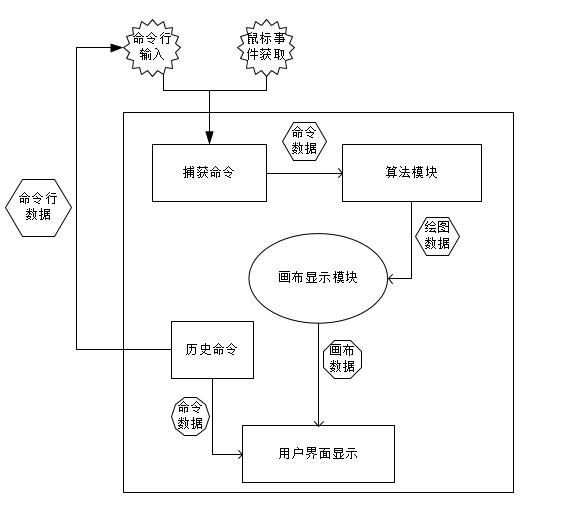

程序运行主界面:

    

该界面上按钮***[新建画布]***将会创建一个新的Canvas，根据产生的顺序，第i个画布的名字将为"Canvas_i";
画布界面如下:

    

此外:后续添加的list命令会打开如下历史命令界面:

    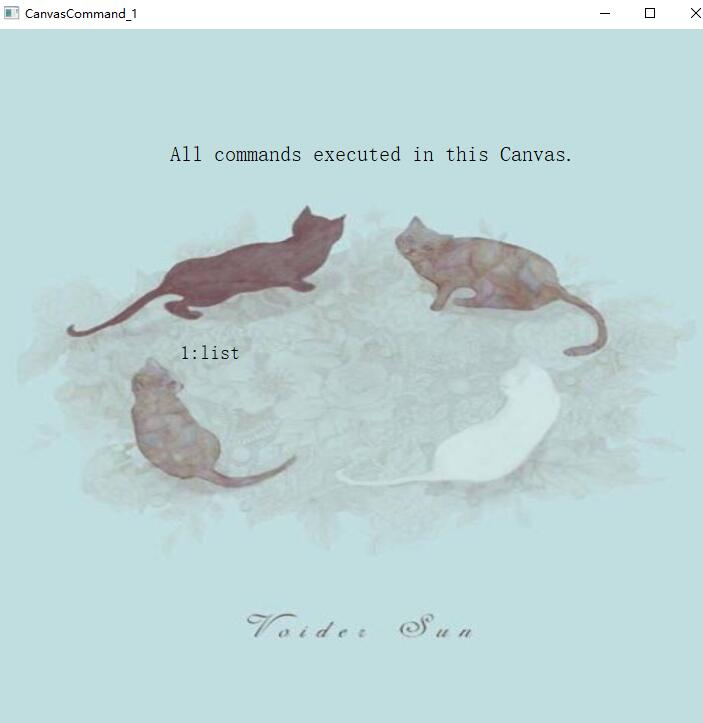

### 基本功能
#### 创建一个画布
按钮`新增画布`可以产生画布，根据产生的顺序，第i个画布的名字将为"Canvas_i";
(前面已经展示过)

#### (1)命令输入方式
1. 读取文件方式:
   读取\*.txt文件，文件夹位于NJU\_CG/scripts文件夹下，在主界面命令行中输入input name(文件名，不包含后缀)即可.(如果是运行了\*.exe 文件，则\*.txt在此文件夹下的scripts中).
2. 读取命令方式:
    * 打印历史命令
        输入:list canvas\_id(对id为canvas\_ 1的画布时，命令最后的1可以缺省，否则需输入对应的id)后：
        打印画布id为canvas\_id的画布上所有执行过的正确指令,其中canvas\_id 缺省为1.
        

            
        

    * 输出历史命令到文件
        打印id为canvas\_id的画布上所有执行过的正确指令，输出定向到文件中,可以在
        name:string 输出文件名
        输入output name canvas\_id(对id为canvas\_ 1的画布时，命令最后的1可以缺省，否则需输入对应的id)
        输出文件可以在NJU\_CG/scripts文件夹下找到。(如果是运行了\*.exe 文件，则\*.txt在此文件夹下的scripts中).
    * 重置画布
        原来的画布
        

            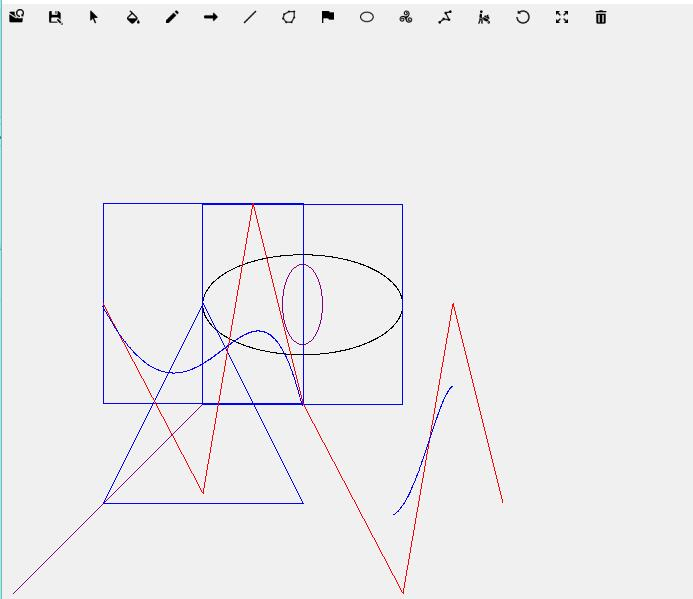
        

        输入resetCanvas 700 700 1(重置id为canvas\_1的画布时，1可以缺省，否则需输入对应的id)后
        

            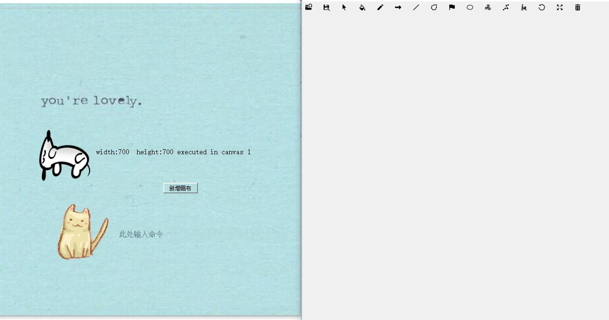
        

    * 保存画布
        例如若保存画布1的内容，命名为Mydraw;
        输入saveCanvas Mydraw 1(1可以省略，保存其他画布时不可以省略)即可,将可以在NJU\_CG/NJU\_CG/images 目录中找到Mydraw.bmp文件(如果是运行了\*.exe文件，则MyDraw 在此文件夹下的images中)
    *  直线绘制
        输入以下命令后(对id为canvas\_1$的画布时，命令最后的1可以缺省，否则需输入对应的id)后：
        drawLine 1 10 10 200 200 DDA 1
        drawLine 2 300 300 400 100 Bresenham 1
        将会得到:
        

            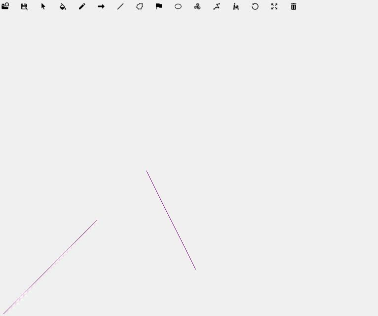
        

    * 多边形绘制
        输入以下命令后(对id为$canvas\_1的画布时，命令最后的1可以缺省，否则需输入对应的id)后：
        drawPolygon 1 4 Bresenham 300 500 560 500 530 300 330 300 1
        drawPolygon 2 4 DDA 70 100 330 100 300 300 100 300 1
        将会得到:
        

            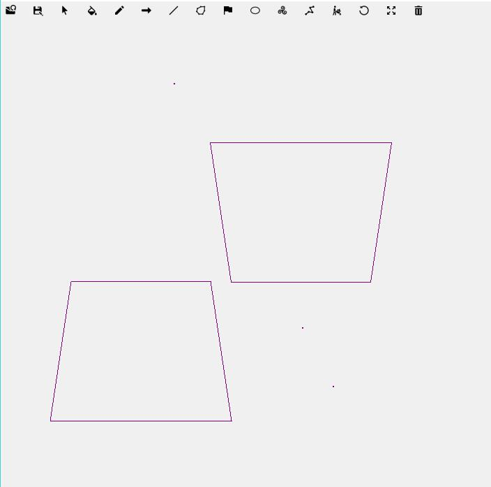
        

    * 椭圆绘制
        输入以下命令后(对id为canvas\_1的画布时，命令最后的1可以缺省，否则需输入对应的id)后：
        drawEllipse 1 300 300 40 20 1
        drawEllipse 2 200 200 100 80 1
        将会得到:
        

            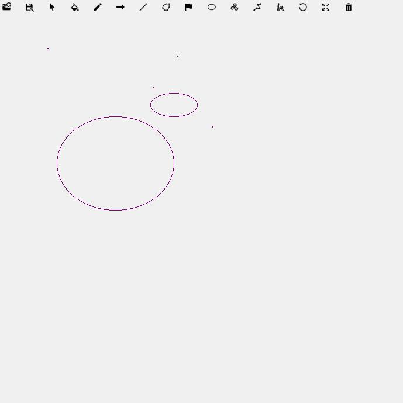
        

    * 曲线绘制
        输入以下命令后(对id为canvas\_1的画布时，命令最后的1可以缺省，否则需输入对应的id)后：
        drawCurve 1 7 B-spline 0 200 50 100 70 300 150 320 230 300 300 400 450 100 1
        drawCurve 2 7 Bezier 0 400 50 300 70 500 150 520 230 500 300 600 450 300 1
        将会得到:
        

            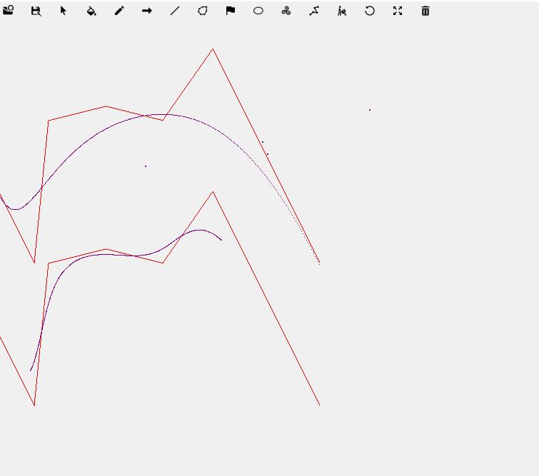
        

    * 图元平移:
        依次输入以下命令后(对id为canvas\_1$的画布时，命令最后的1可以缺省，否则需输入对应的id)后：
        drawLine 1 10 10 200 200 DDA 1
        

            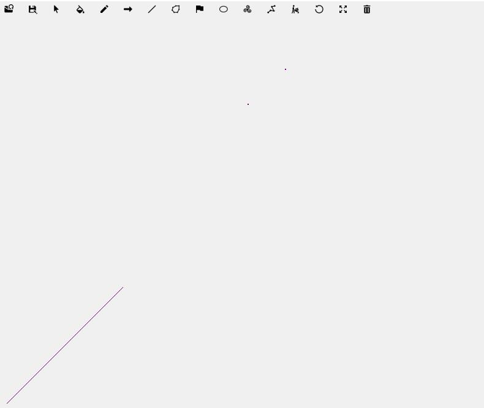
        

        再输入translate 1 150 100 1
        将会得到:
        

            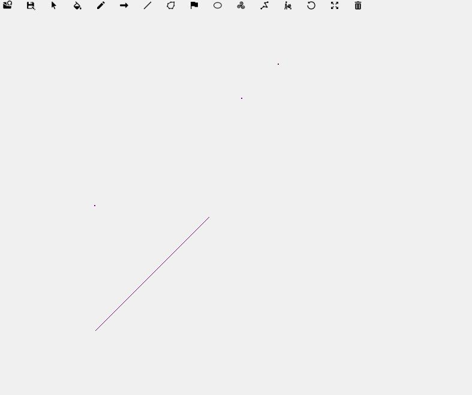
        

    * 图元旋转:
        依次输入以下命令后(对id为canvas\_1的画布时，命令最后的1可以缺省，否则需输入对应的id)后：
        drawEllipse 1 200 200 100 80 1
        

            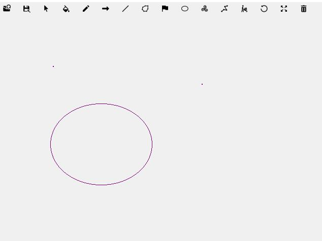
        

        再输入rotate 1 200 200 90 1\\
        将会得到:
        

            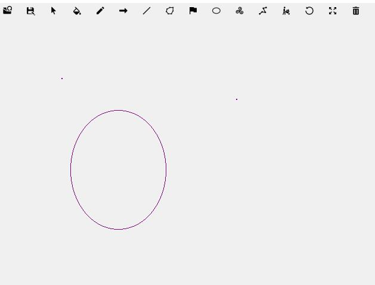
        

    *  图元缩放:
        依次输入以下命令后(对id为canvas\_1的画布时，命令最后的1可以缺省，否则需输入对应的id)后：
        drawEllipse 1 200 200 100 80 1
        

            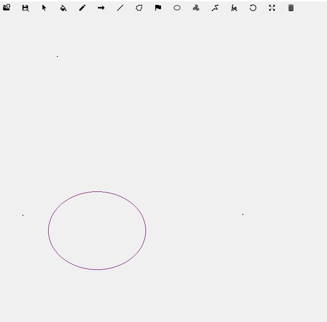
        

        再输入scale 1 200 200 0.5 1
        

            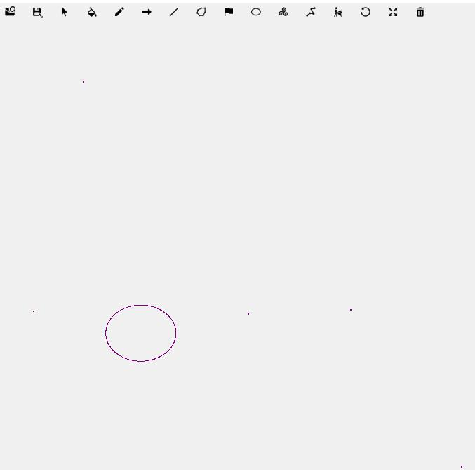
        

    * 线段裁剪:
        依次输入以下命令后(对id为canvas\_1的画布时，命令最后的1可以缺省，否则需输入对应的id)后：
        drawLine 1 0 100 201 301 DDA 1
        drawLine 2 601 100 401 301 DDA 1
        setColor 0 0 0 1
        drawPolygon 3 4 DDA 100 100 300 100 300 300 100 300 1
        drawPolygon 4 4 DDA 470 170 530 170 530 230 470 230 1
        

            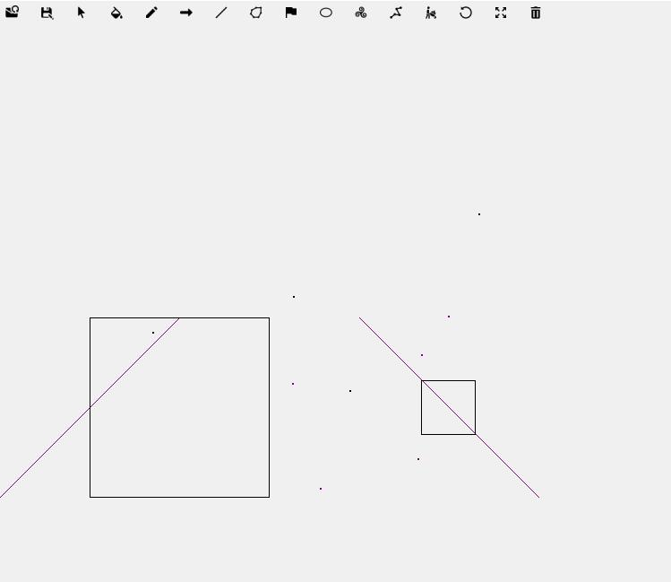
        

        再输入clip 1 100 100 300 300 Cohen-Sutherland 1
        clip 2 470 130 530 230 Liang-Barsky 1
        将会得到:
        

            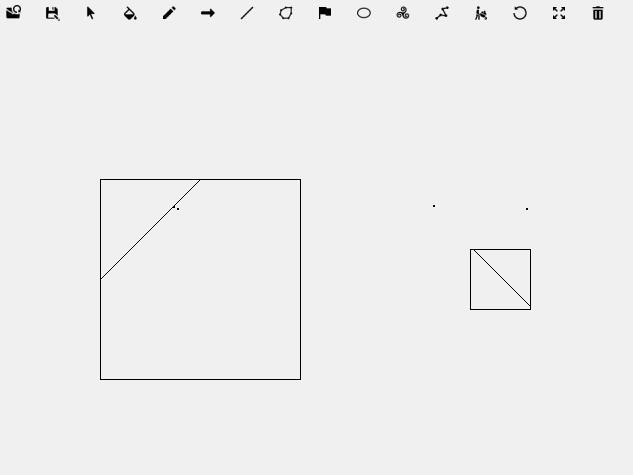
        

#### (2)鼠标键盘操作方式
##### 鼠标键盘操作方法
1. 重置画布
    点击画布界面中的图标,随后在弹出的对话框输入新的width和height，点击confirm即可.
2. 保存画布
    点击画布界面中的图标,随后在出现windows系统类似的保存对话框，进行相关的操作即可.
3. 修改画笔颜色
    点击画布界面中的图标,随后在出现windows系统类似的RGB调色对话框，进行相关的操作即可.
4. 直线绘制(Bresenham算法)
    点击画布界面中的图标,随后在界面中左击两个位置，即可产生一个以此两个位置为端点的直线;
5. 直线绘制(DDA算法)
    点击画布界面中的图标随后在界面中左击两个位置，即可产生一个以此两个位置为端点的直线;
6. 多边形绘制(Bresenham算法)
    点击画布界面中的图标, 随后在界面依次左击多边形的各个顶点的位置，最后再点击一次右键，即可产生所要的多边形；
7. 多边形绘制(DDA算法)
    点击画布界面中的图标, 随后在界面依次左击多边形的各个顶点的位置，最后再点击一次右键，即可产生所要的多边形；
8. 绘制椭圆
   点击画布界面中的图标, 随后在弹出的对话框输入相应id,x,y,rx,ry数据后，点击确认即可.
9. 绘制曲线(Bezier曲线)
    点击画布界面中的图标, 随后在界面依次左击各个点击控制点的位置，最后再点击一次右键,即可生成Bezier曲线，为方便观察，控制点之间的线段也会绘制出来.
10. 绘制曲线(B-spline曲线)
    点击画布界面中的图标, 随后在界面依次左击各个点击控制点的位置，最后再点击一次右键,即可生成B-spline曲线，为方便观察，控制点之间的线段也会绘制出来.
11. 图元平移
    点击画布界面中的图标, 随机左键摁住需要平移的图元，鼠标移动，移动完成后，松开左键即可.
12. 图元旋转
    点击画布界面中的图标, 在弹出的对话框输入id,x,y,r等数据即可.
13. 图元缩放
    点击画布界面中的图标, 在弹出的对话框输入id,x,y,s等数据即可.
14. 图元裁剪
    点击画布界面中的图标, 在弹出的对话框输入id,x1,y1,x2,y2,algorithm等数据即可.(algorithm支持Cohen-Sutherland和Liang-Barsky)
##### 鼠标键盘操作效果展示
1. 清空画笔模式，绘制一个点功能就不做赘余的展示了
2. 重置画布
    点击重置按钮 后，画布清空，对话框提示输入新的画布度和高度
    

       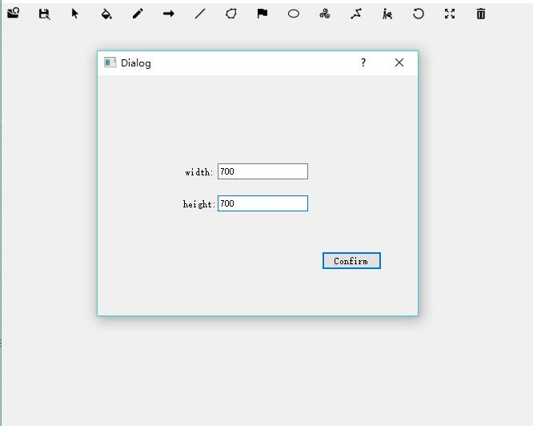
    

    随后确认以后，即可看见相应的结果。
3. 保存画布
    点击保存按钮 后
    

       
    

    随后选择保存路径，确认以后，即可在对应的位置找到相应的bmp文件.
    由于纯白色背景对眼睛不友好，于是背景色被修改成了以下RGB(219,207,202) 对应的颜色;
4. 改变颜色:改变画笔的颜色
    点击颜色修改按钮 后,弹出对话框
    

       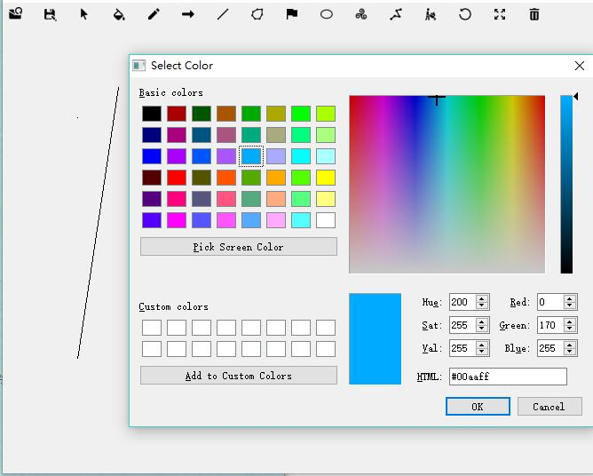
    

    随后进行颜色选择，确认后再次绘制即可看见效果.
    

       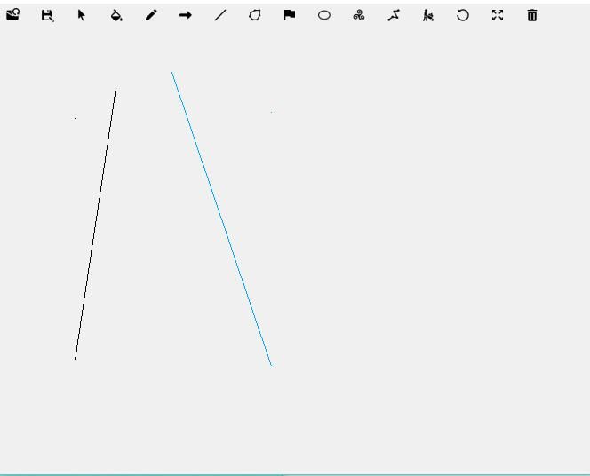
    

5. 绘制直线模式(Bresenham 算法):画笔进入以Bresenham算法绘制直线的模式
    点击绘制直线模式(Bresenham)按钮 后
    随后进行绘制即可.绘制结果如下:
    

       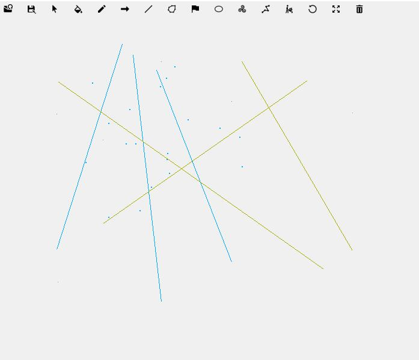
    

6. 绘制直线模式(DDA 算法):画笔进入以DDA算法绘制直线的模式
    点击绘制直线模式(DDA)按钮 后
    随后进行绘制即可.绘制结果如下:
    

       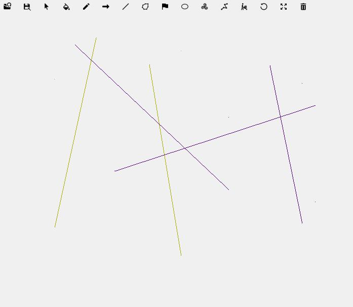
    

7. 绘制多边形模式(Bresenham 算法):画笔进入以Bresenham算法绘制多边形的模式:
    点击绘制多边形模式(Bresenham)按钮 后
    随后进行绘制即可.绘制结果如下:
    

       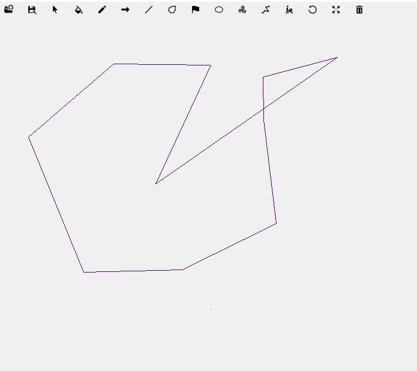
    

8. 绘制多边形模式(DDA 算法):画笔进入以DDA算法绘制多边形的模式:
    点击绘制多边形模式(DDA)按钮 后
    随后进行绘制即可.绘制结果如下:
    

       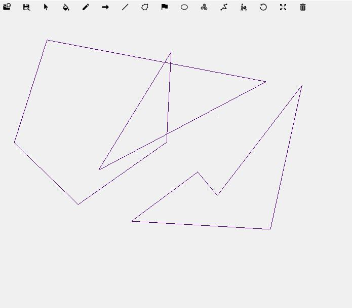
    

9. 绘制椭圆模式:画笔进入绘制椭圆的模式
    点击绘制椭圆模式按钮 后
    随后输入数据确认;
    

       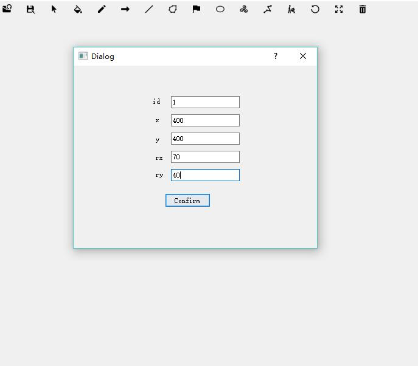
    

    绘制结果如下:
    

       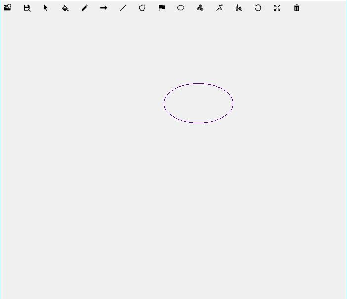
    

10. 绘制曲线模式(Bezier曲线):画笔进入以Bezier算法绘制曲线的模式
    点击绘制曲线模式(Bezier)按钮  后
    随后进行绘制即可
    

       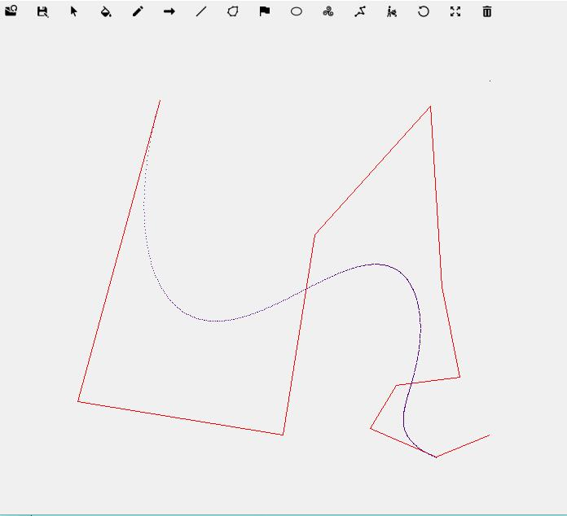
    

11. 绘制曲线模式(B-spline曲线):画笔进入以Bezier算法绘制曲线的模式
    点击绘制曲线模式(B-spline)按钮  后
    随后进行绘制即可
    

       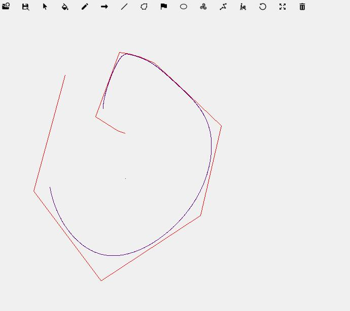
    

12. 平移模式按钮:进入图元平移模式
    

       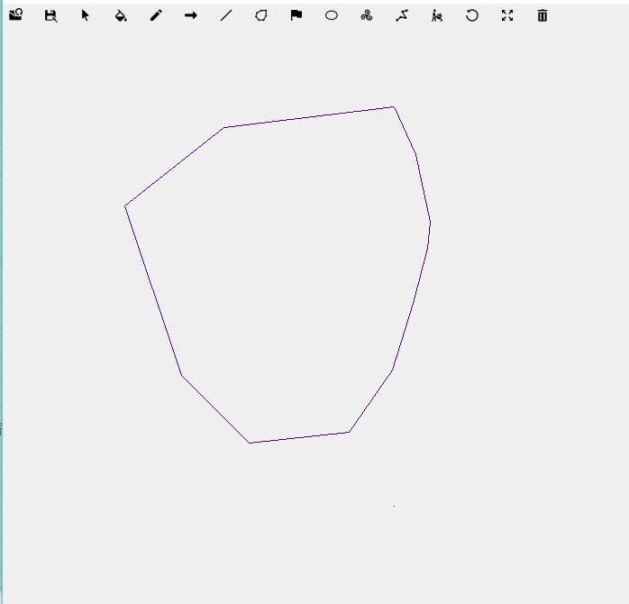
    

    点击平移模式按钮  后
    随后进行平移操作即可
    

       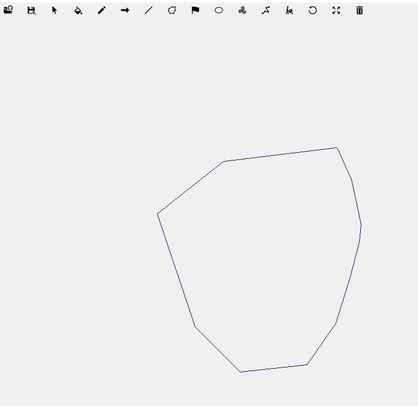
    

13. 旋转模式按钮:进入图元旋转模式
    点击旋转模式按钮  后
    

       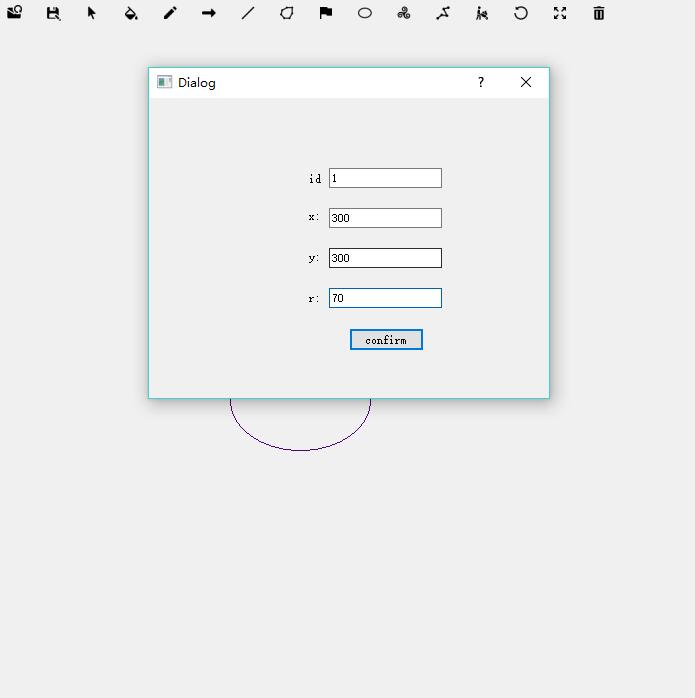
    

    随后进行输入相关数据并确认即可
    

       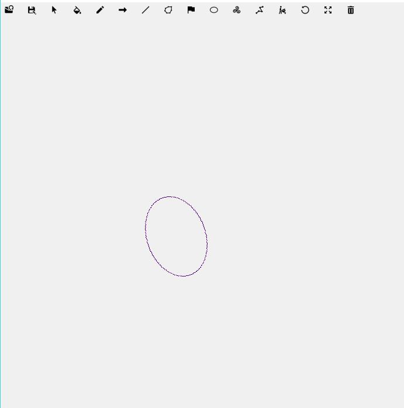
    

14. 放缩模式按钮:进入图元放缩模式
    点击缩放模式按钮 后
    

       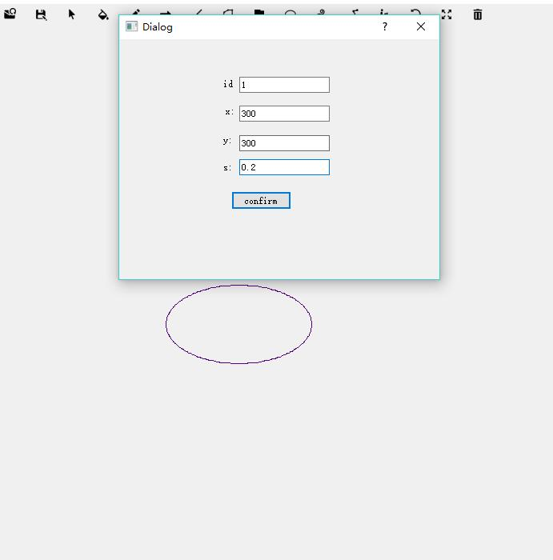
    

    随后进行输入相关数据并确认即可
    

       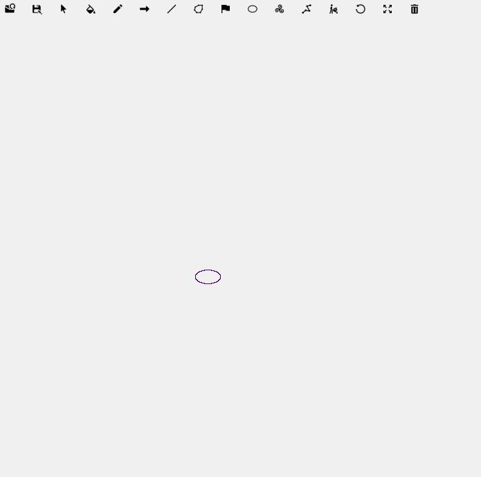
    

15. 裁剪模式按钮:进入图元裁剪模式
    点击裁剪模式按钮 后
    

       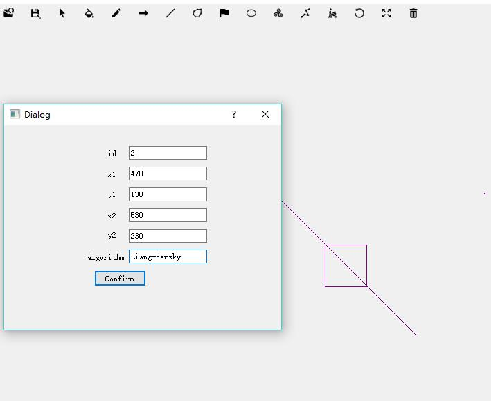
    

    随后进行输入相关数据并确认即可
    

       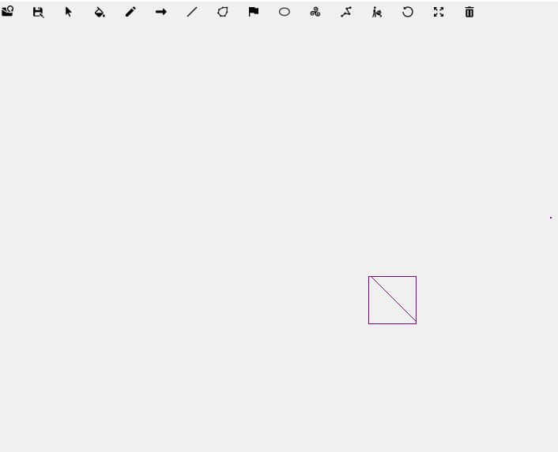
    

#### 额外说明,多个画布时的操作
如果用户自己生成了多个画布(即多次`新增画布`后)，如果希望某次操作是对第i个画布操作的，可在指令后面添加一个参数 i，否则默认是对第一个画布(窗口名字为"Canvas_1")的操作。
例如:
`resetCanvas 400 400 (1)(可以缺省为1)`是对第一个画布的重置操作
`resetCanvas 400 400 2`是对第二个画布的重置操作命令
对其他指令同理